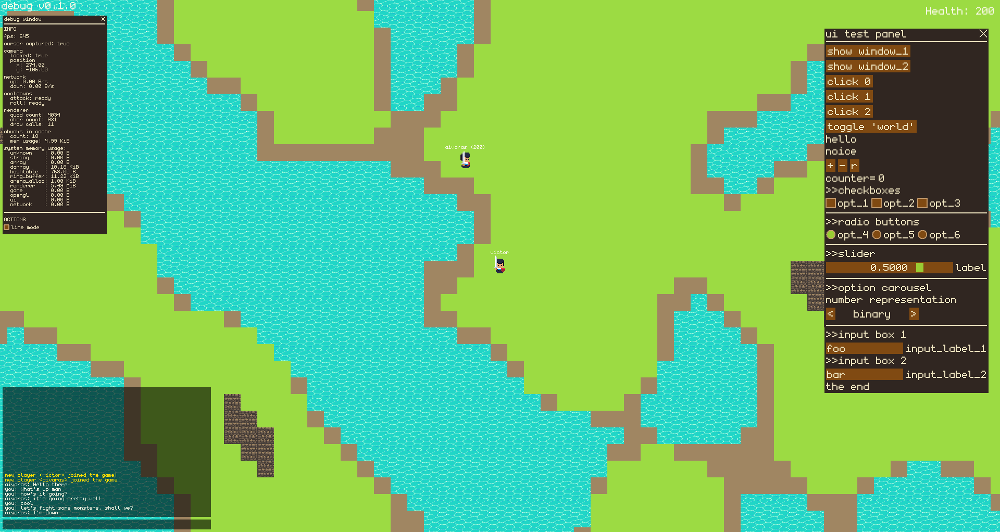

# Getting started

## Clone the repository
```shell
git clone https://github.com/wikcioo/starlore.git
cd starlore
```

## Linux

Build the project
```shell
make -j4 config=[debug,release]
```

Start the server
```shell
./build/[debug,release]/server/server <port>
```

Start the client
```shell
./build/[debug,release]/client/client <username>
```

# Screenshots
 
